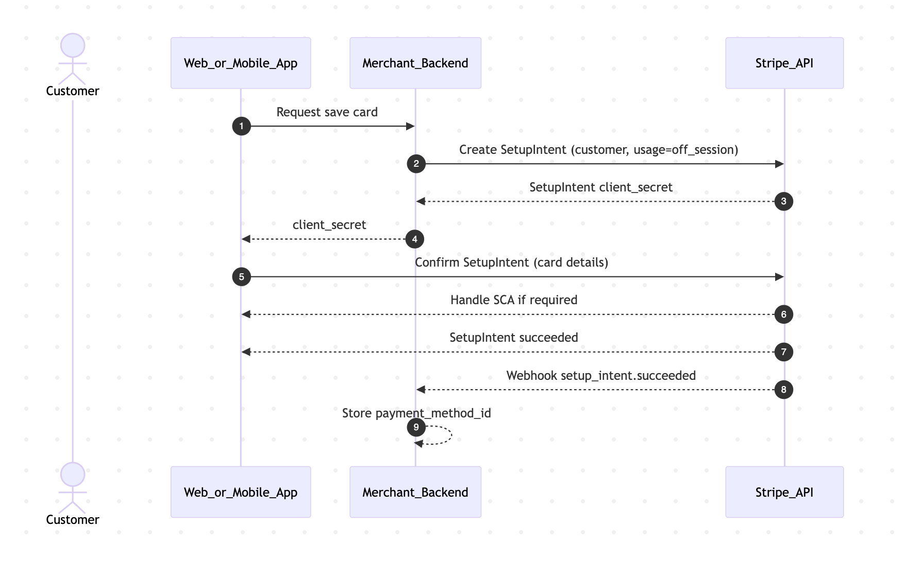
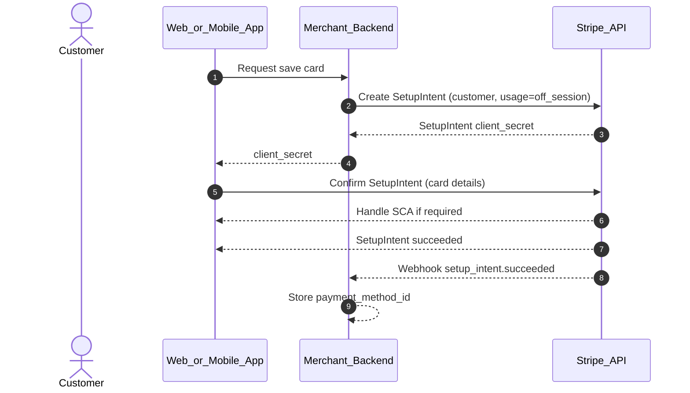
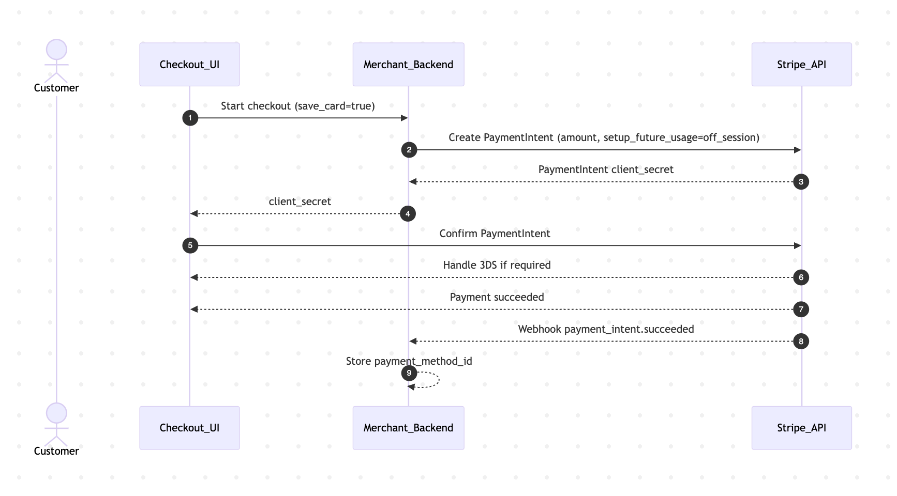
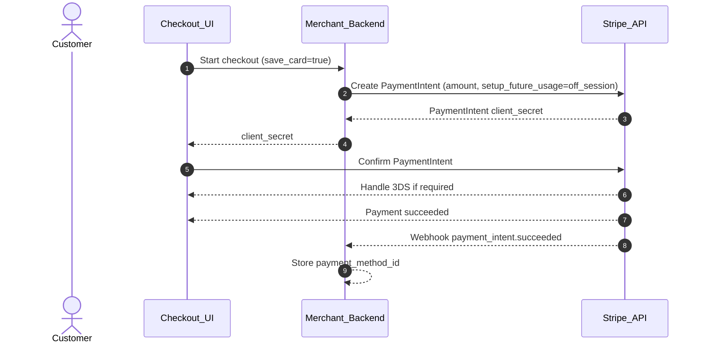
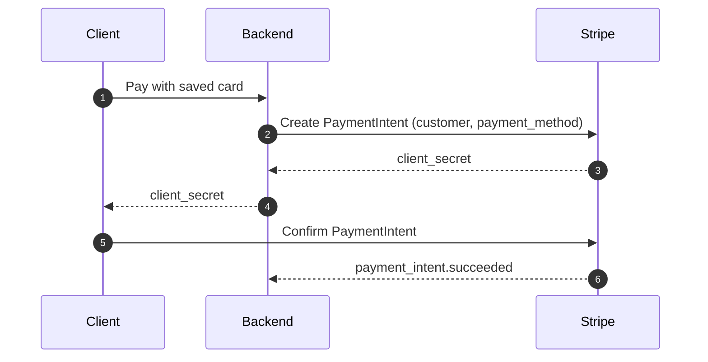
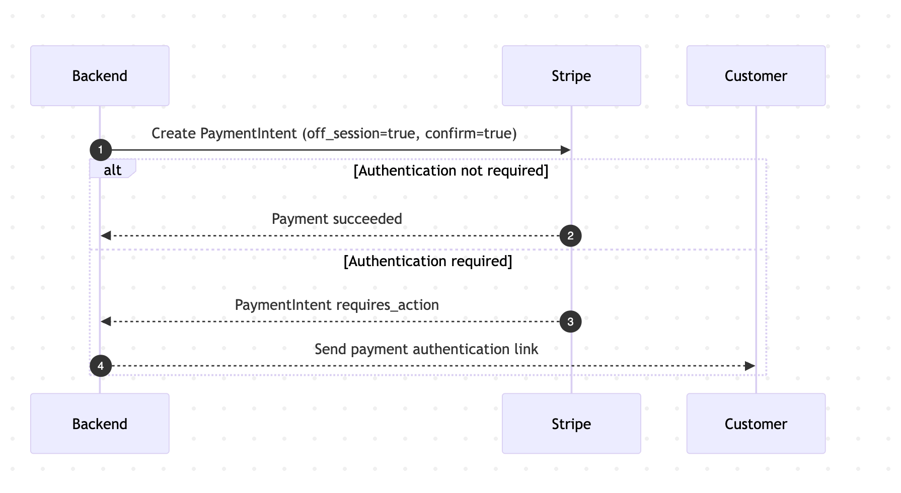
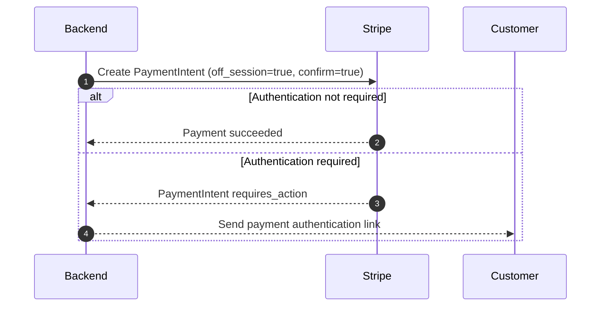

B# Card on File in Stripe

## PaymentIntents, SetupIntents, and Secure Reuse of Cards

---

## 1. Overview

**Card on File (CoF)** means securely storing a customer’s card so it can be reused for future payments.
Stripe implements CoF using the **Payment Methods API** together with **Intents**:

* **PaymentIntent** → charge money
* **SetupIntent** → save a payment method for later use
* **PaymentMethod** → represents the saved card (`pm_...`)

> ⚠️ Stripe **does not recommend storing tokens (`tok_...`)** anymore for card-on-file. Tokens are single-use and legacy.

---

## 2. Core Objects and Responsibilities

| Object          | Purpose                        | Stored by You |
| --------------- | ------------------------------ | ------------- |
| `Customer`      | Represents your user in Stripe | ✅ `cus_...`   |
| `PaymentMethod` | Saved card details             | ✅ `pm_...`    |
| `SetupIntent`   | Authenticate + save card       | ❌             |
| `PaymentIntent` | Charge card (now or later)     | ❌             |
| `token`         | Legacy single-use              | ❌             |

**Golden rule**
You store only:

* `customer_id`
* `payment_method_id`
* Non-sensitive metadata (brand, last4, exp date)

You **never** store PAN, CVC, or raw card data.

---

## 3. Two Correct Ways to Save a Card on File

### Option A — Save Card Without Charging (SetupIntent)

Use this for:

* “Add card” screens
* Account billing setup
* Vaulting cards for future use

### Flow summary

1. Backend creates a `SetupIntent`
2. Client confirms it with Stripe.js / SDK
3. Stripe authenticates user if required (3DS)
4. Card is attached to the Customer

### Sequence diagram — SetupIntent (save card only)





---

## 4. Save Card During a Payment (PaymentIntent + setup_future_usage)

Use this for:

* Checkout with “Save card for next time”
* First purchase + reuse later

### Key idea

A **single PaymentIntent** both:

* charges the customer **now**
* prepares the card for **future use**

### Important flag

```text
setup_future_usage = off_session
```

This tells Stripe to:

* perform extra authentication now if needed
* make future off-session charges more reliable

---

### Sequence diagram — Pay + Save Card





---

## 5. Charging a Saved Card Later

### A. On-Session Charge (Customer Present)

Customer is logged in or actively paying.




---

### B. Off-Session Charge (Customer Not Present)

Used for:

* Subscriptions
* Post-pay billing
* Usage fees





---

## 6. Handling SCA and Failures

### Why SetupIntent matters

If you don’t authenticate properly upfront:

* Banks may reject future off-session charges
* You’ll need to re-contact the customer

### Best practices

* Use `SetupIntent` or `setup_future_usage`
* Store customer consent
* Always rely on **webhooks** as the source of truth

---

## 7. Managing Cards on File

### List saved cards

```text
GET /v1/payment_methods?customer=cus_xxx&type=card
```

### Set default card

```text
Customer.invoice_settings.default_payment_method = pm_xxx
```

### Remove a card

```text
Detach PaymentMethod from Customer
```

---

## 8. Compliance and Consent

Stripe requires you to:

* Clearly disclose future charges
* Obtain explicit user consent
* Allow easy cancellation

This is especially important for **off-session** payments.

---

## 9. What NOT to Do ❌

* ❌ Store raw card data
* ❌ Reuse `tok_...` tokens
* ❌ Charge cards off-session without consent
* ❌ Skip webhooks

---

## 10. Recommended Architecture Summary

```text
Client (Stripe.js / SDK)
   ↓
SetupIntent or PaymentIntent
   ↓
PaymentMethod (pm_xxx)
   ↓
Customer (cus_xxx)
   ↓
Future Payments via PaymentIntent
```

---

## 11. When to Use What

| Scenario                | Use                                |
| ----------------------- | ---------------------------------- |
| Add card without charge | SetupIntent                        |
| Checkout + save card    | PaymentIntent + setup_future_usage |
| Subscription billing    | SetupIntent + off_session          |
| Invoice billing         | Customer + default payment method  |
| POS / Terminal          | PaymentIntent (Terminal SDK)       |

